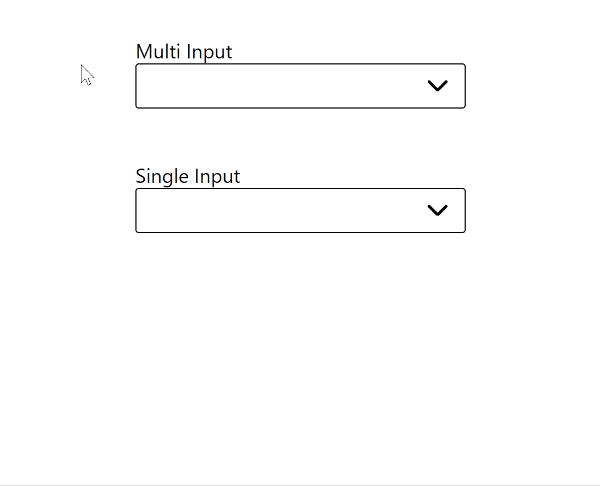

# a11y-select-react

## Intention

- Inspired by [react-select](https://github.com/JedWatson/react-select) - a really awesome project that - at the time of this writing - breaks when using a screen reader such as JAWS and NVDA (specifically in an Electron application). 
- Because of that breaking behavior, I wanted to create an accessible select dropdown from scratch.
- These are early days, so probably not production ready. Will update soon with more updates.
